# TerminalGraph

[](https://github.com/titanomachy/terminal-graph/actions/workflows/docs.yml)

Pure-Nim terminal charts: connected lines, horizontal bars, static and live
OHLC candles, irregular XY and scatter plots, responsive multiplot dashboards,
2D surfaces, filled contours, and sparklines.

The package renders strings with Unicode and ANSI styling—there is no Python
runtime or external plotting backend. Importing `terminal_graph` has no side
effects and does not change terminal state.

<p align="center">
  <a href="examples/live_graph.nim">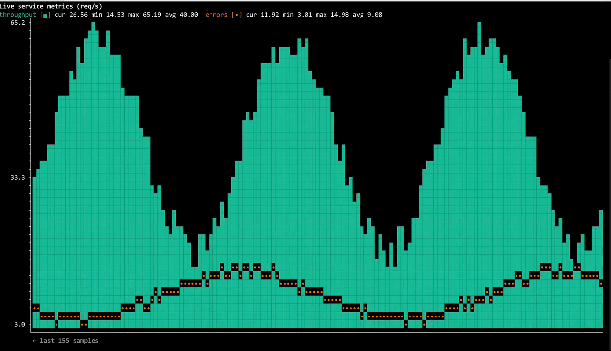</a>
  <a href="examples/streaming_line_graph.nim">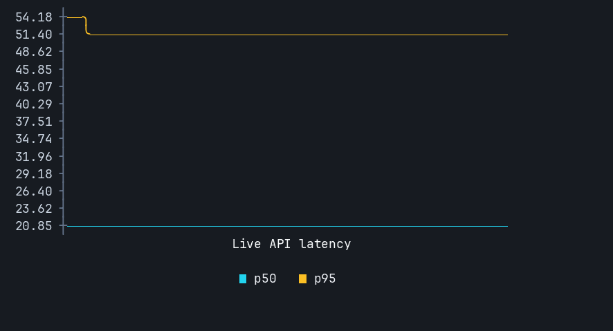</a>
  <a href="examples/streaming_candle_graph.nim">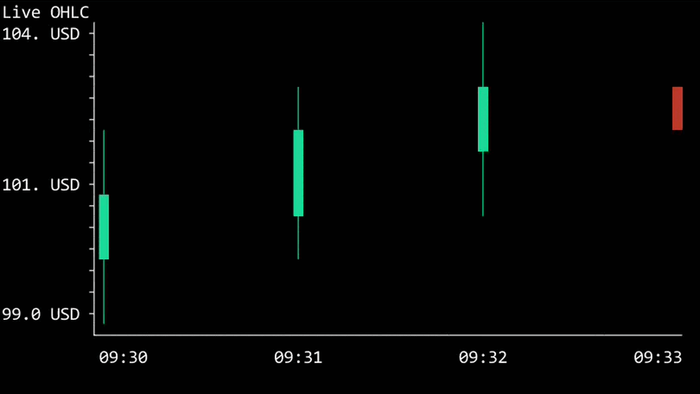</a>
</p>
<p align="center"><a href="#examples">More examples</a></p>

## Platform support

TerminalGraph has been tested on Linux and Windows. On Windows I tested with the Terminal app which comes with Windows, other terminals may or may not work. It should also work on macOS through its standard POSIX terminal and ANSI/VT support, but macOS has not yet been tested directly.

## Requirements

- Nim 2.0.0 or newer
- [`terminal_style`](https://github.com/titanomachy/terminal-style) 0.1.1 or newer, installed from GitHub
- No runtime dependencies beyond `terminal_style`

## Contents

- [Platform support](#platform-support)
- [Requirements](#requirements)
- [Installation](#installation)
- [Quick start](#quick-start)
- [API overview](#api-overview)
  - [Connected lines](#connected-lines)
  - [Horizontal bars](#horizontal-bars)
  - [OHLC candles](#ohlc-candles)
  - [XY and scatter](#xy-and-scatter)
  - [Static graphs](#static-graphs)
  - [Sparklines](#sparklines)
  - [Surfaces and contours](#surfaces-and-contours)
  - [Multiplot layouts](#multiplot-layouts)
  - [Live displays](#live-displays)
    - [Live and streaming examples](#live-and-streaming-examples)
  - [Terminal styling](#terminal-styling)
- [Examples](#examples)
- [Development and documentation](#development-and-documentation)
- [Attribution and license](#attribution-and-license)

## Installation

Install the current version with Nimble:

```sh
nimble install terminal_style
nimble install terminal_graph
```

Or if you prefer directly via Github:
```sh
nimble install https://github.com/titanomachy/terminal-style
nimble install https://github.com/titanomachy/terminal-graph
```

Then import the complete core API:

```nim
import terminal_graph
```

The main module also re-exports `terminal_style`, so colors, reusable styles,
ANSI stripping, and display-width helpers do not need a second import. Typed
objects and CSV/JSON parsing use opt-in modules to keep macros and parsers out
of the core facade.

## Quick start

One façade import is enough to render a chart:

```nim
import terminal_graph

echo plot(
  [3, 4, 9, 6, 2, 4, 5, 8],
  graphWidth(40),
  graphHeight(8),
  graphCaption("Request latency"),
  graphSeriesColors([colorBrightCyan])
)
```

## API overview

| Graph family | Main API | Highlights |
| --- | --- | --- |
| [Connected lines](#connected-lines) | `plot`, `plotMany`, `AsciiGraphConfig` | Interpolation, labeled axes, formatters, legends, custom glyphs, gradients, thresholds, and NaN gaps |
| [Horizontal bars](#horizontal-bars) | `plotBars`, `BarGraphOptions` | Single-series, grouped, and stacked positive/negative bars around a shared zero axis |
| [OHLC candles](#ohlc-candles) | `plotCandles`, `CandlePlotOptions`, `LiveCandleGraph` | Ordered periods, fixed or automatic price ranges, streaming history, and in-progress candle updates |
| [XY and scatter](#xy-and-scatter) | `plotXY`, `plotXYMany`, `plotScatter`, `plotScatterMany` | Explicit coordinates, fixed or automatic viewports, clipping, labels, markers, and legends |
| [Static graphs](#static-graphs) | `StaticGraph`, `initStaticGraph`, `render` | Bounded histories, line/fill series, statistics, automatic or fixed ranges, and deterministic dimensions |
| [Sparklines](#sparklines) | `sparkline`, `SparklineOptions` | Shared or automatic ranges, gaps, custom ticks, and ANSI-256 palettes |
| [Surfaces and contours](#surfaces-and-contours) | `plotSurface`, `plotContour`, `plot2D` | Matrix or flat data, resampling, fixed ranges, palettes, scales, and plain-text output |
| [Multiplot layouts](#multiplot-layouts) | `multiplot`, `multiplotResponsive` | ANSI/Unicode-aware grids, auto-fit columns, breakpoints, alignment, and deferred width-aware renderers |
| [Live displays](#live-displays) | `LiveGraph`, `LiveLineGraph`, `LiveCandleGraph`, `LiveDashboard` | Bounded streaming data, frame rendering, in-place redraws, alternate-screen dashboards, and resize-safe composition |
| [Terminal styling](#terminal-styling) | Re-exported `terminal_style` API | Standard, bright, ANSI-256, RGB, and hex colors plus ANSI-aware measuring, slicing, padding, and wrapping |

Most applications should import `terminal_graph`. Focused imports such as
`terminal_graph/sparkline_graphs` are also supported. Rendering is string-based
and side-effect free; explicit dimensions and options make snapshots
deterministic.

### Connected lines

`plot` renders one sample-indexed series; `plotMany` places several series on
the same axes. Option builders configure dimensions, labels, formatters,
colors, gradients, thresholds, and X-axis ticks.

```nim
echo plot(
  [18.0, 21.0, 19.0, 26.0, 34.0, 31.0],
  graphWidth(40),
  graphHeight(8),
  graphCaption("Request latency"),
  graphSeriesColors([colorBrightCyan])
)
```

<p><a href="examples/line_graph.nim">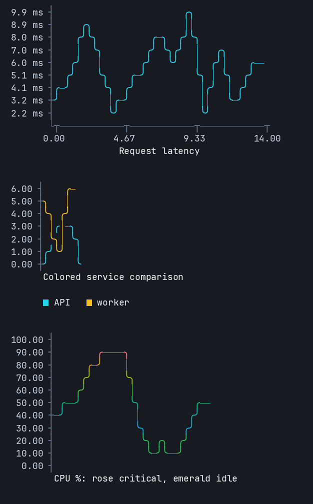</a></p>

```sh
nim r --path:src examples/line_graph.nim
```

### Horizontal bars

Bar charts use a shared zero baseline, so positive and negative values remain
directly comparable. Multiple series may be grouped or stacked.

```nim
var options = initBarGraphOptions()
options.caption = "Regional change"
options.unit = "%"
options.seriesLegends = @["current", "previous"]

echo plotBars(
  ["North", "South"],
  @[@[18.0, -7.0], @[12.0, 5.0]],
  options
)
```

<p><a href="examples/bar_graph.nim">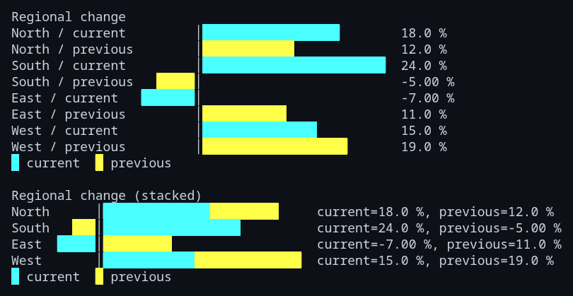</a></p>

```sh
nim r --path:src examples/bar_graph.nim
```

### OHLC candles

`Candle` represents one ordered OHLC interval. Automatic ranges use visible
lows and highs without forcing zero into the viewport; explicit ranges clip
the candle geometry. Static rendering requires every candle to fit the canvas.

```nim
var options = initCandlePlotOptions()
options.caption = "Daily OHLC"
options.unit = "USD"

echo plotCandles(
  ["Mon", "Tue", "Wed"],
  [
    candle(101, 106, 99, 104),
    candle(104, 108, 102, 103),
    candle(103, 109, 101, 108)
  ],
  options
)
```

<p><a href="examples/candle_graph.nim">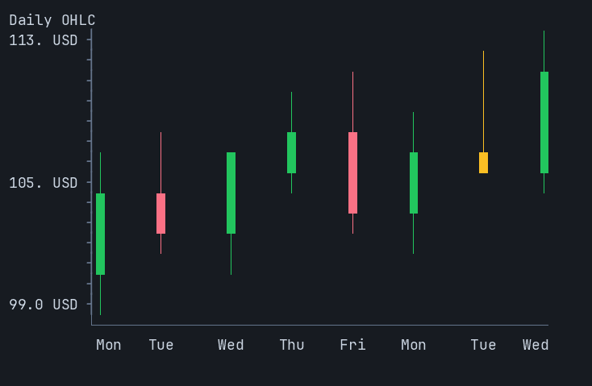</a></p>

```sh
nim r --path:src examples/candle_graph.nim
```

### XY and scatter

XY charts use explicit numeric coordinates rather than sample indices. A
series can be connected in its supplied order or rendered as independent
scatter points, with fixed viewports and clipping when needed.

```nim
var options = initXYPlotOptions()
options.caption = "Latency samples"
options.xLabel = "time"
options.yLabel = "ms"

echo plotScatter([
  xyPoint(-2.0, 3.0),
  xyPoint(0.0, 5.0),
  xyPoint(3.0, 4.0)
], options)
```

<p><a href="examples/xy_graph.nim">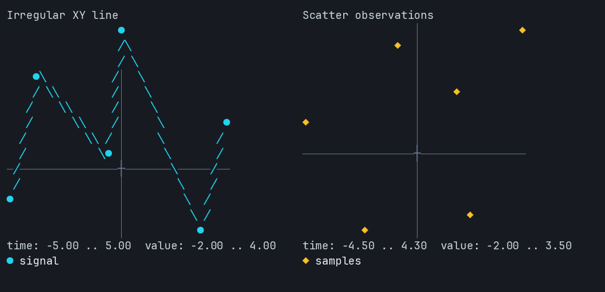</a></p>

```sh
nim r --path:src examples/xy_graph.nim
```

### Static graphs

`StaticGraph` owns bounded series data and renders a complete deterministic
frame with optional statistics. Series may use markers or filled columns.

```nim
var graph = initStaticGraph("Weekly requests", unit = "requests")
let requests = graph.addSeries("requests", style = psFill, marker = "▄")
graph.push(requests, [12.0, 18.0, 15.0, 27.0, 35.0, 31.0, 42.0])

echo graph.render(width = 64, height = 14, useColor = false)
```

<p><a href="examples/static_graph.nim">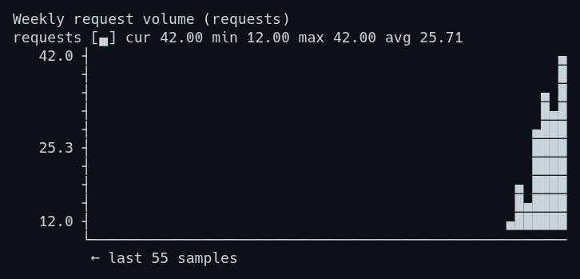</a></p>

```sh
nim r --path:src examples/static_graph.nim
```

### Sparklines

Sparklines embed compact trends in ordinary text. Options provide shared
ranges, custom tick glyphs, gap handling, and ANSI-256 palettes.

```nim
echo "Latency  ", sparkline([18, 21, 19, 26, 34, 31, 45]), " ms"

var shared = initSparklineOptions()
shared.setSparklineRange(0.0, 100.0)
echo "Load     ", sparkline([10, 25, 40, 75, 100], shared)
```

<p><a href="examples/sparkline_graph.nim">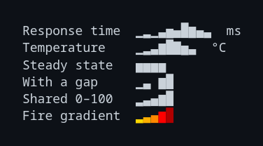</a></p>

```sh
nim r --path:src examples/sparkline_graph.nim
```

### Surfaces and contours

Surface plots pack two sampled rows into each terminal row. Contours render the
same matrix as discrete filled bands; both support resampling, palettes, and
fixed value ranges.

```nim
let field = @[
  @[0.0, 0.5, 1.0],
  @[0.5, 1.0, 0.5],
  @[1.0, 0.5, 0.0]
]

var options = initSurfacePlotOptions()
options.caption = "Service heatmap"
echo plotContour(field, options)
```

<p><a href="examples/advanced_graphs.nim">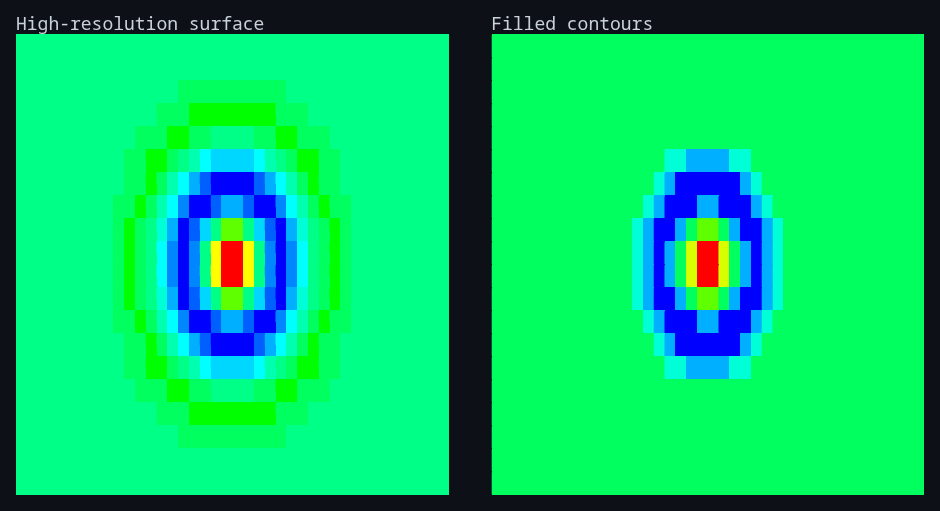</a></p>

```sh
nim r --path:src examples/advanced_graphs.nim
```

### Multiplot layouts

Multiplot combines already-rendered strings into ANSI- and Unicode-aware grids.
Responsive render callbacks receive their assigned width before rendering, so
dashboards can reflow without wrapping individual charts.

```nim
let
  latency = plot([18, 24, 21, 29], graphWidth(24), graphHeight(6))
  load = plot([40, 55, 48, 63], graphWidth(24), graphHeight(6))

echo multiplot([latency, load], columns = 2, horizontalGap = 4)
```

<p><a href="examples/multiplot_graph.nim">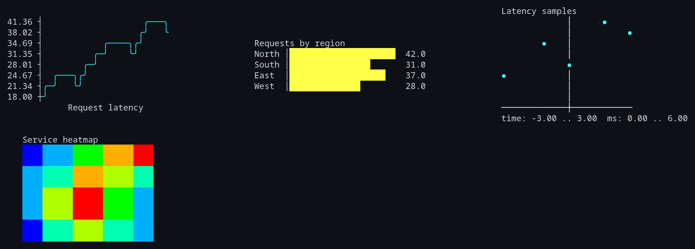</a></p>

```sh
nim r --path:src examples/multiplot_graph.nim
```

### Live displays

`LiveGraph`, `LiveLineGraph`, and `LiveCandleGraph` retain bounded streaming
state. Their `renderFrame()` methods are side-effect free; `startLive`, `draw`,
and `stopLive` provide in-place terminal output. Always restore terminal state
in a `finally` block.

```nim
var options = initCandlePlotOptions()
options.caption = "Live OHLC"
var graph = initLiveCandleGraph(maxCandles = 80, options = options)
graph.push(candle(101, 106, 99, 104), "09:30")

graph.startLive()
try:
  graph.updateLatest(candle(101, 108, 98, 107))
  graph.draw()
finally:
  graph.stopLive()
```

Use `LiveDashboard` for resize-safe full-screen redraws of arbitrary frames,
including responsive multiplot output. On supported Windows consoles, live
sessions enable virtual-terminal processing and restore the original mode.

The focused [`streaming_candle_graph.nim`](examples/streaming_candle_graph.nim)
example appends completed periods and repeatedly replaces the newest forming
candle. Its `renderFrame()` output can also be placed beside another graph in a
`LiveDashboard`.

#### Live and streaming examples

<table>
  <tr>
    <td width="50%">
      <a href="examples/streaming_candle_graph.nim"></a><br>
      <strong><a href="examples/streaming_candle_graph.nim"><code>streaming_candle_graph.nim</code></a></strong><br>
      <code>nim r --path:src examples/streaming_candle_graph.nim</code><br>
      Completed periods with a repeatedly updated in-progress candle.
    </td>
    <td width="50%">
      <a href="examples/live_graph.nim"></a><br>
      <strong><a href="examples/live_graph.nim"><code>live_graph.nim</code></a></strong><br>
      <code>nim r --path:src examples/live_graph.nim</code><br>
      Generated service metrics redrawn fluidly as a full terminal frame.
    </td>
  </tr>
  <tr>
    <td width="50%">
      <a href="examples/streaming_line_graph.nim"></a><br>
      <strong><a href="examples/streaming_line_graph.nim"><code>streaming_line_graph.nim</code></a></strong><br>
      <code>nim r --path:src examples/streaming_line_graph.nim</code><br>
      Two connected series in bounded streaming windows.
    </td>
    <td width="50%">
      <a href="examples/streaming_multiplot_graph.nim">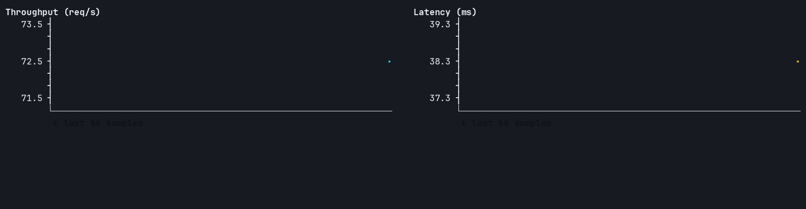</a><br>
      <strong><a href="examples/streaming_multiplot_graph.nim"><code>streaming_multiplot_graph.nim</code></a></strong><br>
      <code>nim r --path:src examples/streaming_multiplot_graph.nim</code><br>
      Two live graphs in a resize-aware full-screen dashboard.
    </td>
  </tr>
  <tr>
    <td colspan="2">
      <a href="examples/streaming_sparklines.nim"></a><br>
      <strong><a href="examples/streaming_sparklines.nim"><code>streaming_sparklines.nim</code></a></strong><br>
      <code>nim r --path:src examples/streaming_sparklines.nim</code><br>
      A compact CPU and memory dashboard from reusable sparklines.
    </td>
  </tr>
</table>

### Terminal styling

The façade re-exports `terminal_style`, including standard, indexed, RGB, and
hex colors; text attributes; and ANSI-aware measuring, slicing, padding, and
wrapping.

```nim
echo bold(brightCyan("Build succeeded"))
echo onRgb(35, 42, 58, brightYellow(" warning "))
echo "visible cells: ", displayWidth(red("A界BC"))
```

## Examples

Each screenshot above links to its focused runnable example. For a finite tour
of every graph family, run:

```sh
nim r --path:src examples/all_graphs.nim
```

<details>
<summary><a href="examples/all_graphs.nim"><code>all_graphs.nim</code></a> — finite tour of every graph family</summary>
<p><a href="examples/images/all_graphs.png">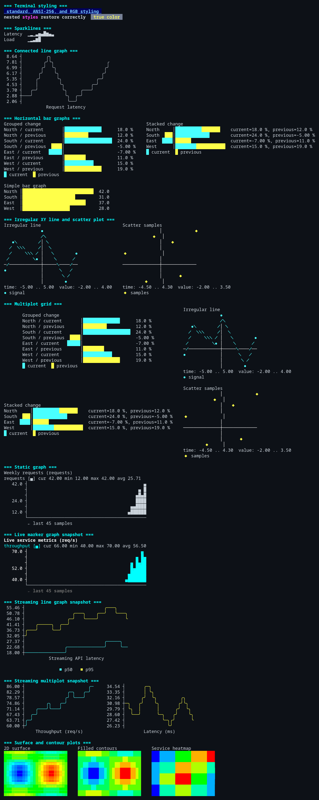</a></p>
</details>

Compile-check every example at once with:

```sh
nimble examples
```

## Development and documentation

```sh
nimble test       # run all test suites
nimble examples   # compile-check all examples
nimble docs       # generate htmldocs/ from public API comments
```

See [CONTRIBUTING.md](CONTRIBUTING.md) for development rules and
[docs/public-api.md](docs/public-api.md) for the example coverage map. The
[generated API documentation](https://titanomachy.github.io/terminal-graph/)
is published from the default branch.

## Attribution and license

The connected line renderer is a Nim port inspired by
[`guptarohit/asciigraph`](https://github.com/guptarohit/asciigraph). Other API
and visualization ideas were inspired by
[`OFThomas/drawIt`](https://gitlab.com/OFThomas/drawIt),
[`Luteva-ssh/nivot`](https://github.com/Luteva-ssh/nivot), and
[`sindresorhus/sparkly`](https://github.com/sindresorhus/sparkly). See
[THIRD_PARTY_NOTICES.md](THIRD_PARTY_NOTICES.md) for the required notice.

`terminal_graph` is released under the [MIT License](LICENSE).
